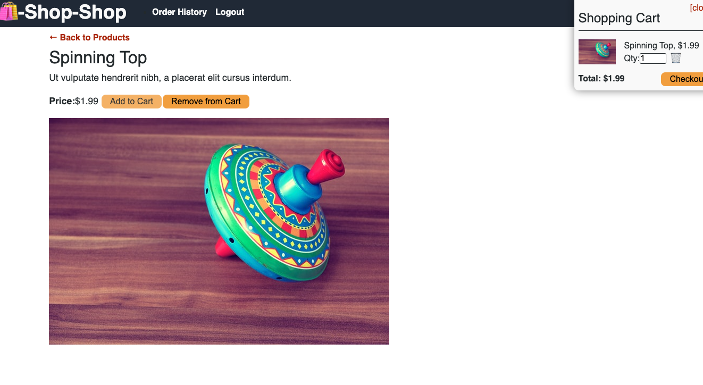
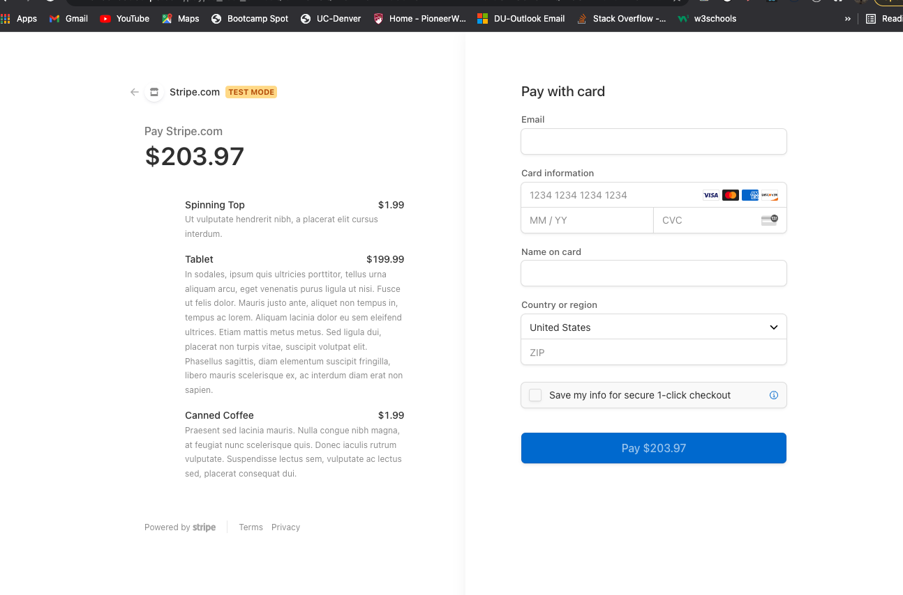

# BAWOOD-REDUX

#22 State Homework: Redux Store

## Description:

As a senior engineer working on an e-commerce platform I WANT my platform to use Redux to manage global state instead of the Context API SO THAT my website's state managemnet is taken out of the React ecosystem.

## Acceptance Criteria

```md
GIVEN an e-commerce platform that uses Redux to manage global state
WHEN I review the app’s store
THEN I find that the app uses a Redux store instead of the Context API
WHEN I review the way the React front end accesses the store
THEN I find that the app uses a Redux provider
WHEN I review the way the app determines changes to its global state
THEN I find that the app passes reducers to a Redux store instead of using the Context API
WHEN I review the way the app extracts state data from the store
THEN I find that the app uses Redux instead of the Context API
WHEN I review the way the app dispatches actions
THEN I find that the app uses Redux instead of the Context API
```

## Screenshots:

- Photo #1: A user logged in successfully.
  

- Photo #2: A user added a product to the cart successfully.
  

- Photo #3: A user was able to check out by going to the shopping cart.
  

## Delopyment links:

- URL to Deployed Application:

- URL to the GitHub Repository: https://github.com/BrockAtwood/BAWOOD-REDUX

## Questions for the Author:

Brock Atwood - If you have any questions, you can Email me @ brockatwood@gmail.com. You can also view my other projects at my GitHub @ http://github.com/BrockAtwood
